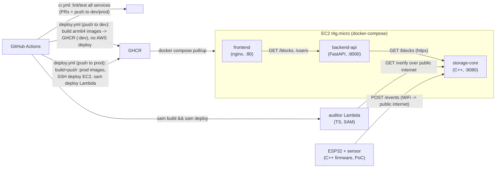

# Architecture — Status: Phase 0 (Walking Skeleton)

This is a living document — updated at the end of every phase to reflect what's actually been built.

## Components

| Component | Stack | Responsibility |
|---|---|---|
| `storage-core` | C++ (CMake) | Hash-chained append-only ledger; REST + WebSocket API |
| `backend-api` | Python, FastAPI | Users/locations/settings/devices DB; proxies storage-core; relays live events to frontend |
| `frontend` | React, Vite, TS | Dashboard with live event feed |
| `auditor` | TypeScript, AWS Lambda | Event-driven anomaly auditor; pulls recent blocks, calls an LLM, drafts incident reports |
| `firmware` | C++, ESP32 (PoC) | Physical sensor devices posting `SENSOR_READING` events directly to storage-core |

## Deployment topology

- Single AWS EC2 `t4g.micro` (free-tier ARM/Graviton) runs `storage-core` + `backend-api` + `frontend` via docker-compose.
- `auditor` Lambda deployed separately via AWS SAM; reaches storage-core over the public internet (no VPC).
- GitHub Actions builds/pushes `linux/arm64` images to GHCR and deploys.

## Phase 0 walking skeleton diagram

Every arrow above is a real network call/deploy step from Phase 0 onward, even while most payloads are stubbed. The ESP32 arrow is documented now but implemented in Phase 1.5.

## Status by component

- `storage-core`: stub only (`/health`, hardcoded `/blocks`, `/verify`) — real implementation is Phase 1.
- `backend-api`: stub only (`/health`, `/blocks` proxy, hardcoded `/users`) — real implementation is Phase 2.
- `frontend`: stub page rendering `/blocks` + `/users` — real dashboard is Phase 3.
- `auditor`: stub Lambda calling `/verify` — real auditor logic is Phase 4.
- `firmware`: not yet started — Phase 1.5.
