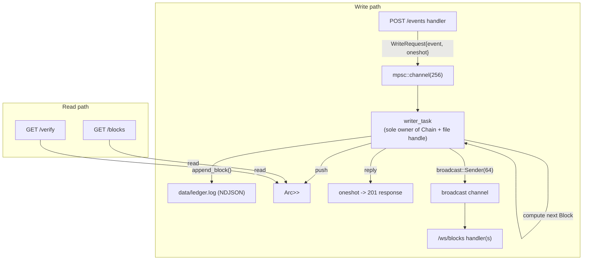

# storage-core — Overview

Status: Phase 1 not yet started (Phase 0 stub only).

## What it is

A hash-chained, append-only audit ledger written in Rust (axum). Single trusted writer, NDJSON persistence, REST + WebSocket API. See [`../decisions/0001-hash-chain-no-pow.md`](../decisions/0001-hash-chain-no-pow.md) and [`../decisions/0002-ndjson-persistence.md`](../decisions/0002-ndjson-persistence.md).

## Crate structure

Single crate, `lib.rs` (core, testable) + thin `main.rs` (entrypoint). See [`../decisions/0004-single-crate-vs-workspace.md`](../decisions/0004-single-crate-vs-workspace.md).

| Module | Responsibility |
|---|---|
| `block.rs` | `Block`, `EventPayload`, hashing logic |
| `chain.rs` | `Chain` (in-memory `Vec<Block>`), `append()`, `verify()` |
| `storage.rs` | NDJSON append-only file I/O: `append_block`, `load_chain`, `open_append` |
| `writer.rs` | Single-writer task: owns chain + file handle, consumes mpsc, persists, broadcasts |
| `api.rs` | axum router + handlers |
| `ws.rs` | `/ws/blocks` WebSocket handler |
| `error.rs` | `AppError` (thiserror) + `IntoResponse` |
| `main.rs` | Config, tracing init, spawn writer task, start server |

## Block data model

```rust
pub struct EventPayload {
    pub event_type: String,    // e.g. "VALVE_OPENED"
    pub location_id: String,
    pub actor: String,
    pub description: String,
    pub metadata: serde_json::Value,
}

pub struct Block {
    pub index: u64,
    pub timestamp: chrono::DateTime<chrono::Utc>,
    pub event: EventPayload,
    pub prev_hash: String,  // hex SHA-256, "0"*64 for genesis
    pub hash: String,       // hex SHA-256
}
```

`hash = SHA256(index.to_le_bytes() || timestamp.to_rfc3339() || serde_json::to_string(event) || prev_hash)`.

## Concurrency model (ring buffer / writer task)



See [`../decisions/0003-ownership-based-concurrency.md`](../decisions/0003-ownership-based-concurrency.md) for why this avoids a `Mutex`/`RwLock` on the write path.

## API surface

| Route | Purpose |
|---|---|
| `GET /health` | Liveness check |
| `POST /events` | Append a new event → returns the resulting `Block` |
| `GET /blocks?from=&to=` | Inclusive index range of blocks + `chain_length` |
| `GET /verify` | Recompute hashes, check chain integrity |
| `GET /ws/blocks` | WebSocket stream of newly appended blocks |

## Config (env vars)

| Var | Default | Purpose |
|---|---|---|
| `BIND_ADDR` | `0.0.0.0:8080` | axum bind address |
| `LEDGER_PATH` | `./data/ledger.log` | NDJSON ledger file |
| `RUST_LOG` | — | `tracing_subscriber::EnvFilter` |

## Weekend plan

1. [Weekend 1 — Core data model](weekend-1-core-data-model.md)
2. [Weekend 2 — Persistence](weekend-2-persistence.md)
3. [Weekend 3 — REST API](weekend-3-rest-api.md)
4. [Weekend 4 — Ring buffer + WebSocket](weekend-4-ring-buffer-ws.md)

Each weekend doc has a "concepts you need" section (filled in before starting) and a "what we built and why" section (filled in after).
