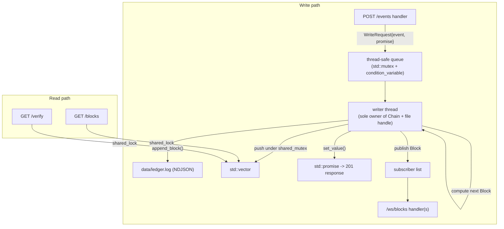

# storage-core — Overview

Status: Phase 1 in progress (data model done; hashing/chain next).

## What it is

A hash-chained, append-only audit ledger written in C++ (CMake build). Single trusted writer, NDJSON persistence, REST + WebSocket API. See [`../decisions/0001-hash-chain-no-pow.md`](../decisions/0001-hash-chain-no-pow.md) and [`../decisions/0002-ndjson-persistence.md`](../decisions/0002-ndjson-persistence.md).

## Project structure

CMake project. Public headers in `include/`, sources in `src/`, vendored header-only libs in `third_party/`, tests in `tests/`.

| File | Responsibility |
|---|---|
| `include/block.hpp` | `Block`, `EventPayload`, `compute_hash`, `genesis` |
| `include/chain.hpp` + `src/chain.cpp` | `Chain` (in-memory `std::vector<Block>`), `append()`, `verify()` |
| `include/storage.hpp` + `src/storage.cpp` | NDJSON append-only file I/O: `append_block`, `load_chain` |
| `include/writer.hpp` + `src/writer.cpp` | Single-writer thread: owns chain + file handle, drains a queue, persists, broadcasts |
| `include/api.hpp` + `src/api.cpp` | HTTP router + handlers |
| `include/ws.hpp` + `src/ws.cpp` | `/ws/blocks` WebSocket handler |
| `include/error.hpp` | error → HTTP response mapping |
| `src/main.cpp` | Config, spawn writer thread, start server |

## Dependencies

All vendored or system — nothing via a package manager.

| Need | Library | How |
|---|---|---|
| JSON | `nlohmann/json` | vendored single header (`third_party/nlohmann/json.hpp`) |
| SHA-256 | OpenSSL `libcrypto` | system (`-lcrypto`, `libssl-dev`) |
| REST + WebSocket | TBD at Weekend 3 (Crow vs cpp-httplib + a WS lib) | vendored |
| Unit tests | `doctest` | vendored single header |

## Block data model

```cpp
struct EventPayload {
    std::string event_type;    // e.g. "VALVE_OPENED"
    std::string location_id;
    std::string actor;
    std::string description;
    nlohmann::json metadata;
};

struct Block {
    std::uint64_t index;
    std::string timestamp;   // RFC3339
    EventPayload event;
    std::string prev_hash;   // hex SHA-256, "0"*64 for genesis
    std::string hash;        // hex SHA-256
};
```

Each type gets `NLOHMANN_DEFINE_TYPE_NON_INTRUSIVE(...)` to generate its JSON
serialization (the equivalent of a derived serializer).

`hash = SHA256(index_as_8_LE_bytes || timestamp || json(event).dump() || prev_hash)`, hex-encoded (lowercase). The field order is fixed and must stay stable.

## Concurrency model (writer thread)



A single writer thread owns the `Chain` and the file handle, so appends are serialized without locking the write path. Readers take a shared lock on the `std::vector<Block>`. This is the C++ analog of the old single-writer design.

## API surface

| Route | Purpose |
|---|---|
| `GET /health` | Liveness check |
| `POST /events` | Append a new event → returns the resulting `Block` |
| `GET /blocks?from=&to=` | Inclusive index range of blocks + `chain_length` |
| `GET /verify` | Recompute hashes, check chain integrity |
| `GET /ws/blocks` | WebSocket stream of newly appended blocks |

## Config (env vars)

| Var | Default | Purpose |
|---|---|---|
| `BIND_ADDR` | `0.0.0.0:8080` | HTTP bind address |
| `LEDGER_PATH` | `./data/ledger.log` | NDJSON ledger file |
| `LOG_LEVEL` | `info` | log verbosity |

## Weekend plan

1. [Weekend 1 — Core data model](weekend-1-core-data-model.md)
2. [Weekend 2 — Persistence](weekend-2-persistence.md)
3. [Weekend 3 — REST API](weekend-3-rest-api.md)
4. [Weekend 4 — Ring buffer + WebSocket](weekend-4-ring-buffer-ws.md)

Each weekend doc has a "concepts you need" section (filled in before starting) and a "what we built and why" section (filled in after).
